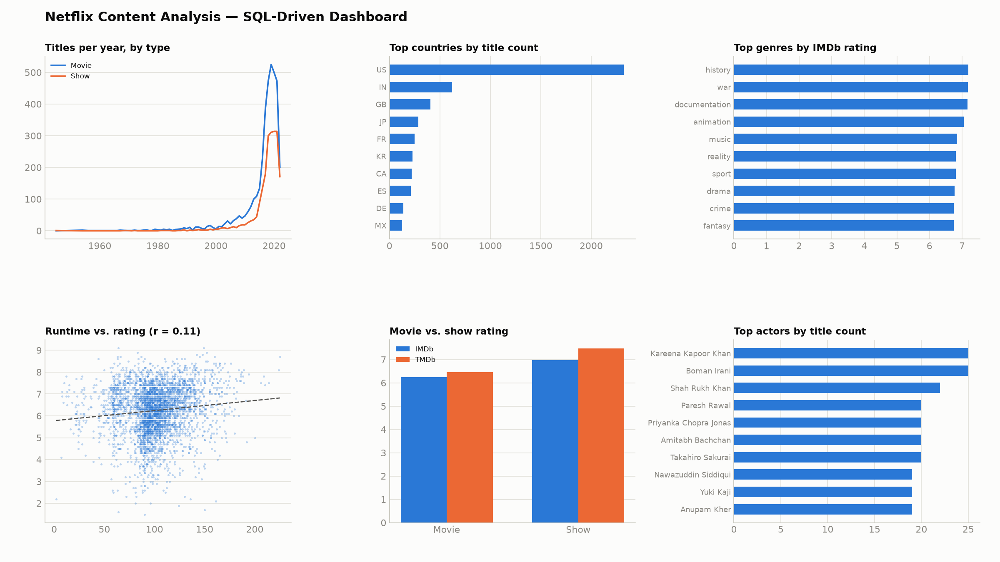

# Netflix Content Strategy & Performance Analysis

An end-to-end analysis of Netflix's catalog (titles + credits) to explore content trends,
ratings, genres, countries, and cast/crew performance — deliberately kept SQL- and Python-native
end to end, with no BI tool in the stack: the dashboard is matplotlib rendering the actual `.sql`
query files, not a separate GUI layer duplicating logic already written in SQL.

**Status:** Phases 0–4 (setup, cleaning, SQL analysis, pandas deep-dive, SQL-driven dashboard)
complete. Write-up in progress.

## Data Source

- `data/raw/titles.csv` — 5,850 titles (3,744 movies, 2,106 shows): genre, country, runtime, ratings, etc.
- `data/raw/credits.csv` — 77,801 cast/crew credit rows linked to titles via `id`.
- Snapshot date: July 2022. Coverage: primarily US/English-language catalog — not global, not current.

## Data Cleaning (Phase 1)

Full step-by-step reasoning is in [`notebooks/cleaning.ipynb`](notebooks/cleaning.ipynb). Summary
of the non-obvious decisions:

| Issue | Decision | Why |
|---|---|---|
| `seasons` null for all 3,744 movies | Left as `NaN`, not filled with 0 | Not applicable to movies, not missing — 0 would be a false claim |
| `age_certification` null for 2,619 titles (45%) | Filled with `'Not Rated'` | Keeps them visible in group-bys instead of pandas silently dropping NaN keys |
| `imdb_score`/`tmdb_score` null (482 / 311 titles; 88 missing both) | Kept in main table, added `has_any_rating` flag | Only 88 titles lack both scores — dropping 45%+ of columns' worth of rows isn't justified; rating questions filter per-score instead |
| `runtime == 0` (14 titles) | Kept raw value, added `runtime_is_missing` flag | 0 minutes isn't a real runtime; flagged rather than dropped so runtime-correlation analysis can exclude them |
| `genres` / `production_countries` (stringified lists) | Exploded into `titles_genres` / `titles_countries` long-format tables | Needed for per-genre/per-country aggregation; empty-list titles (59 / 229) excluded only from the exploded tables, not the main one |
| `id` dedupe check | Verified 0 duplicates | Integrity check, not a fix |
| `credits` duplicate `(id, person_id, role)` groups (173 rows) | Kept as-is | Legitimate double-credits (different character names), not data errors |

Cleaned outputs live in `data/cleaned/` and are loaded into `netflix.db` as `titles_cleaned`,
`titles_genres`, `titles_countries`, and `credits_cleaned` (raw `titles`/`credits` tables remain
for auditing).

## SQL Analysis (Phase 2)

Ten queries in [`sql/`](sql/), each with a business question and rationale in a header comment,
run against the cleaned tables in `netflix.db`. A few standout findings:

| # | Query | Finding |
|---|---|---|
| 02 | Top genres by rating (≥1,000 votes, ≥20 titles) | `history` (7.19) and `war` (7.18) rate highest; `documentation` close behind at 7.17 |
| 04 | Top countries by rating (≥20 rated titles) | South Korea (7.23) and Japan (6.97) outrate the US/UK despite smaller catalogs |
| 05 | Runtime vs. IMDb score correlation (movies) | Pearson r ≈ 0.11 — essentially no relationship; longer ≠ better-rated |
| 06 | IMDb vs. TMDb score gap | Biggest disagreements cluster in kids' content (e.g. *Word Party Songs*, *Thomas & Friends*) — IMDb skews adult, TMDb skews family-audience |
| 07 | Top directors (3+ titles) | Kim Won-seok (8.43), Christopher Nolan (8.33), Martin Scorsese (8.16) |
| 08 | Movies vs. shows avg rating | Shows outrate movies on both IMDb (6.98 vs 6.25) and TMDb (7.48 vs 6.46) — tested for significance in Phase 3 |

## Pandas Deep Dive (Phase 3)

Three Phase 2 findings taken further in [`notebooks/exploration.ipynb`](notebooks/exploration.ipynb):

1. **Is the movie-vs-show rating gap real?** Welch's t-test on IMDb scores (shows n=1,939 vs.
   movies n=3,429): t=23.48, p≈1.2e-114, Cohen's d=0.66. The gap is both statistically
   significant and a genuine medium-to-large effect — not just "significant because the sample
   is huge."
2. **Genre trends by year (2000+, top 6 genres).** All genres ramp sharply from the mid-2010s
   (Netflix's original-content push); drama and comedy stay the two largest throughout.
   Caveat: this tracks production year, not the year a title was added to Netflix.
3. **Actor co-starring network** (top-10-billed cast per title, to keep this about leads rather
   than ensemble/background credits). 148,341 unique pairs. The densest clusters are complete
   cliques from specific troupes/shows — all 6 Monty Python members are paired with each other
   11-14 times each; the *Trailer Park Boys* core cast forms a separate clique — rather than one
   broadly interconnected cast network. Full pair list: `data/cleaned/actor_costar_pairs.csv`.

## Dashboard (Phase 4)

No Tableau/Power BI — [`notebooks/dashboard.ipynb`](notebooks/dashboard.ipynb) runs each `.sql`
file from `sql/` directly against `netflix.db` and renders the result with matplotlib, so every
chart traces back to an actual query rather than logic re-built in a separate GUI tool. Organized
the same way the original 3-page plan was (Overview / Ratings / People); eleven individual PNGs
land in `dashboard/`, and six headline panels are assembled into one image:



| Panel | Source query |
|---|---|
| Titles per year, by type | `sql/01_titles_by_year_and_type.sql` |
| Top countries by title count | `sql/10_top_countries_by_title_count.sql` |
| Top genres by IMDb rating | `sql/02_top_genres_by_rating.sql` |
| Runtime vs. rating (movies) | `sql/05_runtime_vs_rating_correlation.sql` |
| Movie vs. show rating | `sql/08_movie_vs_show_avg_rating.sql` |
| Top actors by title count | `sql/03_top_prolific_actors_directors.sql` |

## Project Structure

```
netflix-content-analysis/
├── data/raw/           # titles.csv, credits.csv (original, untouched)
├── data/cleaned/        # cleaned/exploded CSVs produced by notebooks
├── sql/                 # analysis queries (.sql)
├── notebooks/           # cleaning.ipynb, exploration.ipynb, dashboard.ipynb
├── dashboard/           # PNGs rendered from sql/ queries (dashboard.ipynb output)
├── netflix.db            # SQLite database loaded from the raw CSVs
├── requirements.txt
└── README.md
```

## Setup

```bash
python3 -m venv venv
source venv/bin/activate
pip install -r requirements.txt
```

The SQLite database (`netflix.db`) is built from the raw CSVs via `load_to_sqlite.py`.

## Roadmap

- [x] Phase 0 — Repo setup, raw data loaded into SQLite
- [x] Phase 1 — Data cleaning (genre/country explode, null handling, dedupe, decade column)
- [x] Phase 2 — SQL analysis (10 queries)
- [x] Phase 3 — Pandas deep-dive (stats tests, time series, actor network)
- [x] Phase 4 — Dashboard (SQL-driven, matplotlib — no BI tool)
- [ ] Phase 5 — Write-up (findings, methodology, caveats)

## Caveats

- Data reflects Netflix's catalog as of **July 2022** — it does not include anything added since.
- No viewership data is included; ratings are IMDb/TMDb scores, not Netflix engagement metrics.
